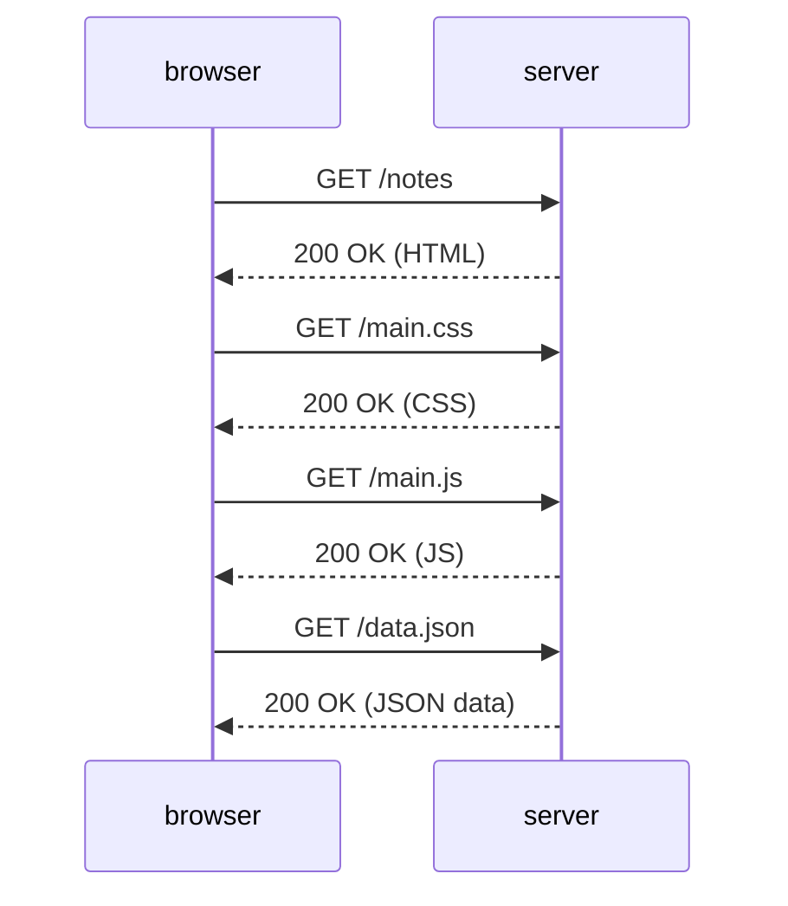

## Exercise 0.4 - Notes page sequence diagram

```mermaid
sequenceDiagram
    participant browser
    participant server

    browser->>server: GET /notes
    server-->>browser: 200 OK (HTML)
    browser->>server: GET /main.css
    server-->>browser: 200 OK (CSS)
    browser->>server: GET /main.js
    server-->>browser: 200 OK (JS)
    browser->>server: GET /data.json
    server-->>browser: 200 OK (JSON data)
```
